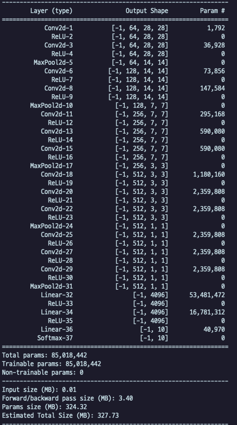

# prography-6th-deep-yoonjaeyoung

### 정확도
MNIST TEST SET 이용시 0.92789

### ADT




### train
```
python test.py --phase train
```

### test (calculate precision)

- model 폴더에 pt 파일을 넣어주세요
- pt 파일 link : https://drive.google.com/file/d/1PNzDeK7SiWprGOUufC39E4OVAuZfq_-P/view?usp=sharing

```
python test.py --phase test --idx_load_param 2000
```

### inference 
```
python test.py --phase inference --path_img data/img5_gray.jpg --idx_load_param 2000
```

- phase : mode 선택
- path_img : inference 시킬 이미지 주소 (오직 gray만 가능)
- idx_load_param : load할 모델의 학습 step  


